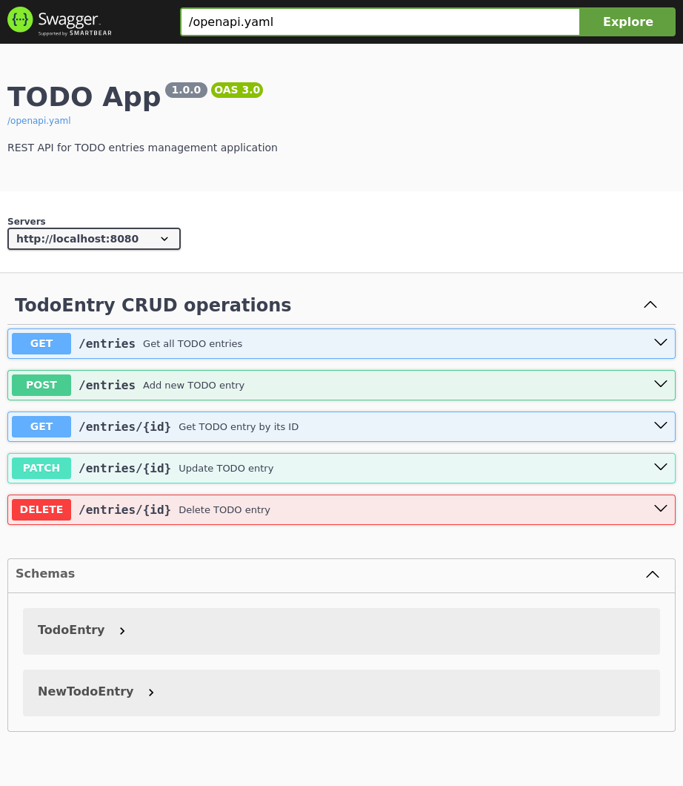
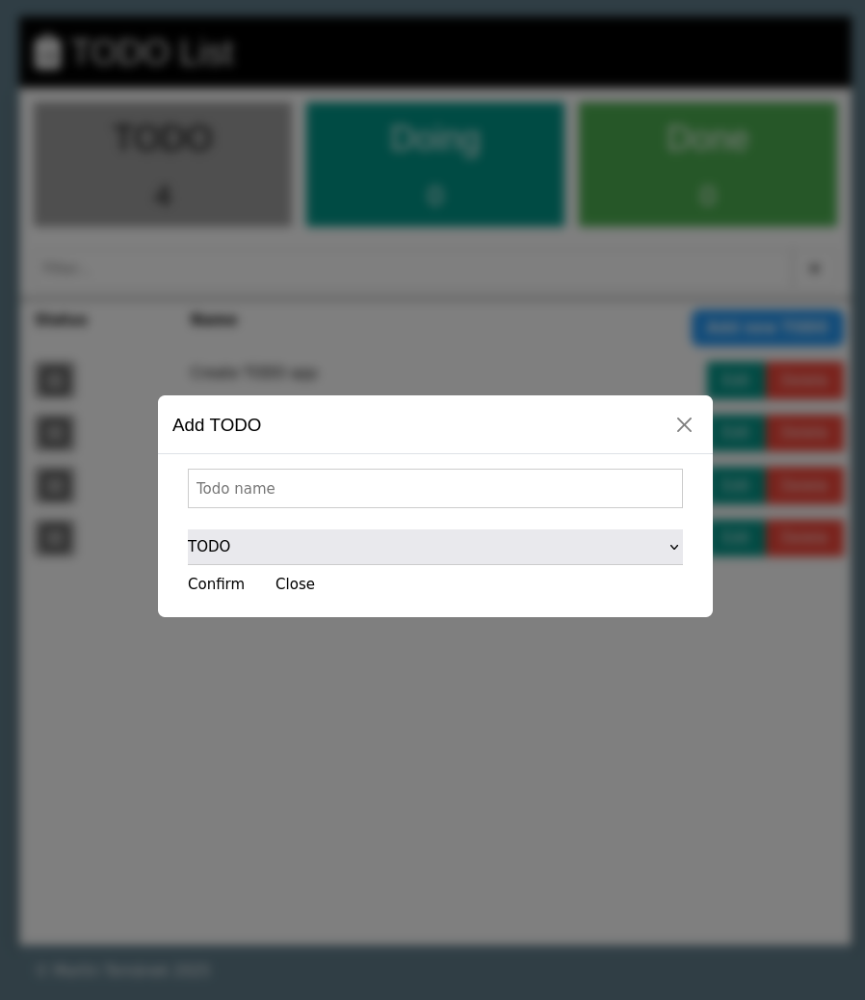
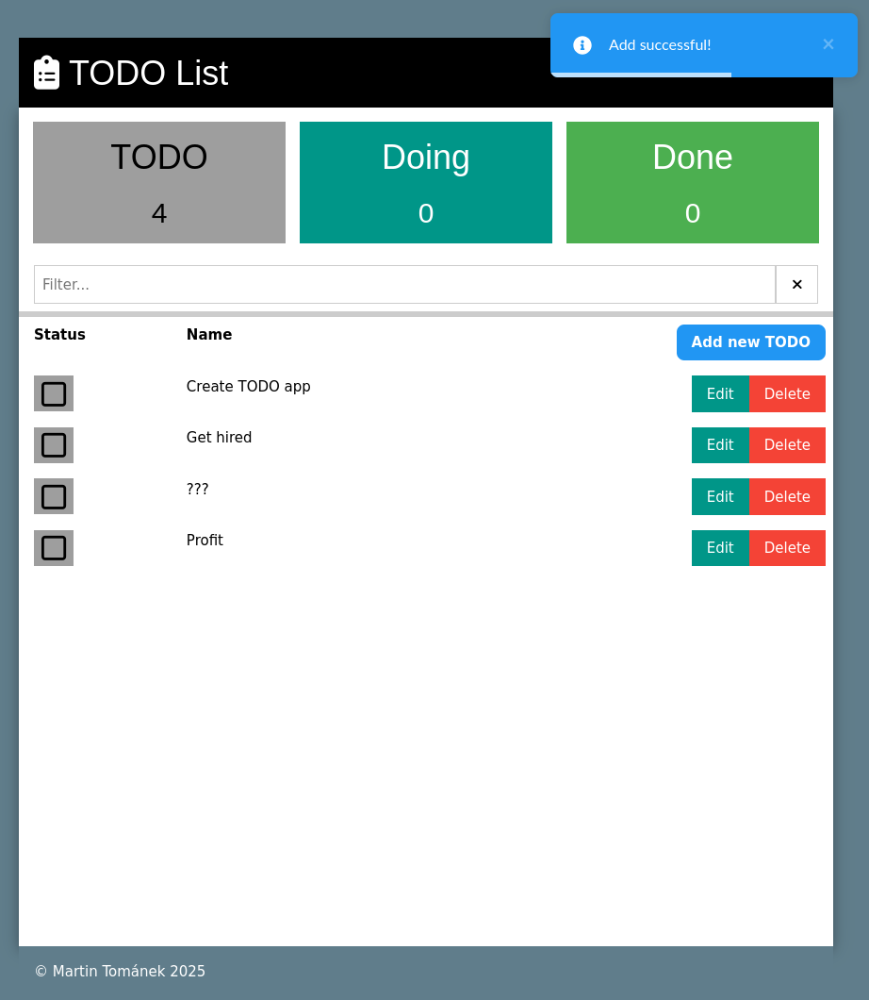
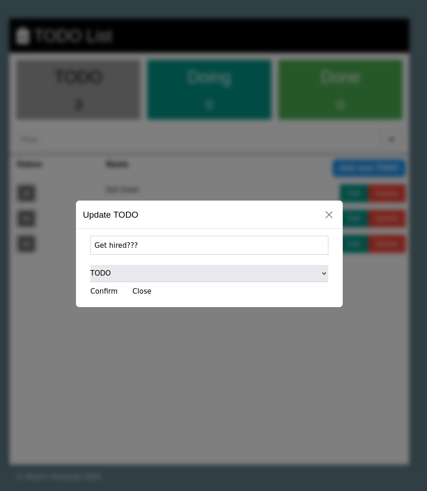
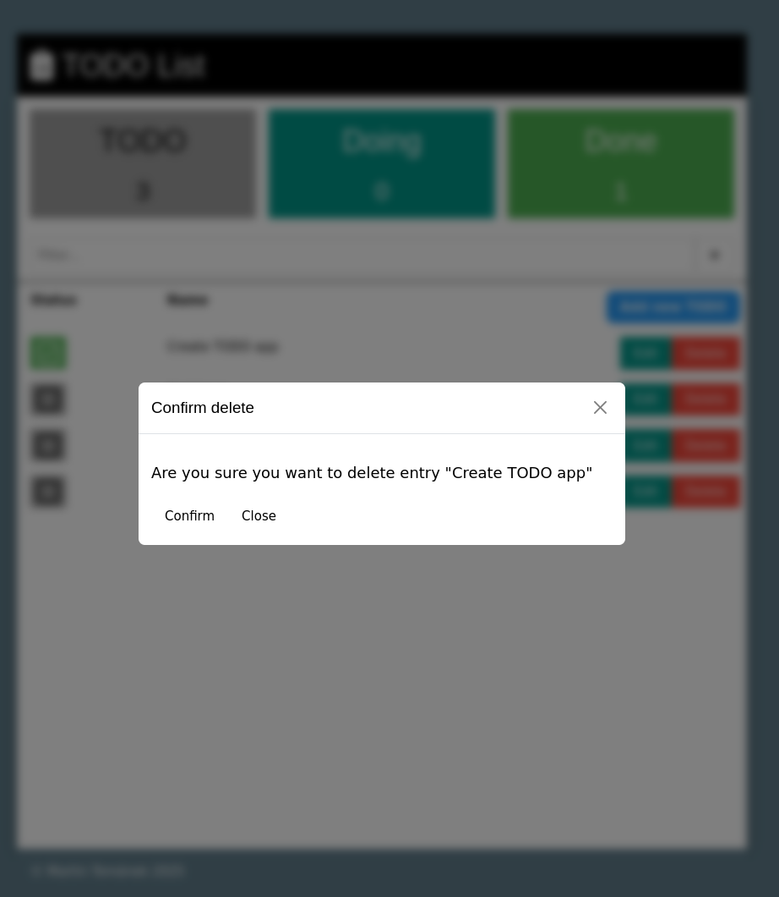
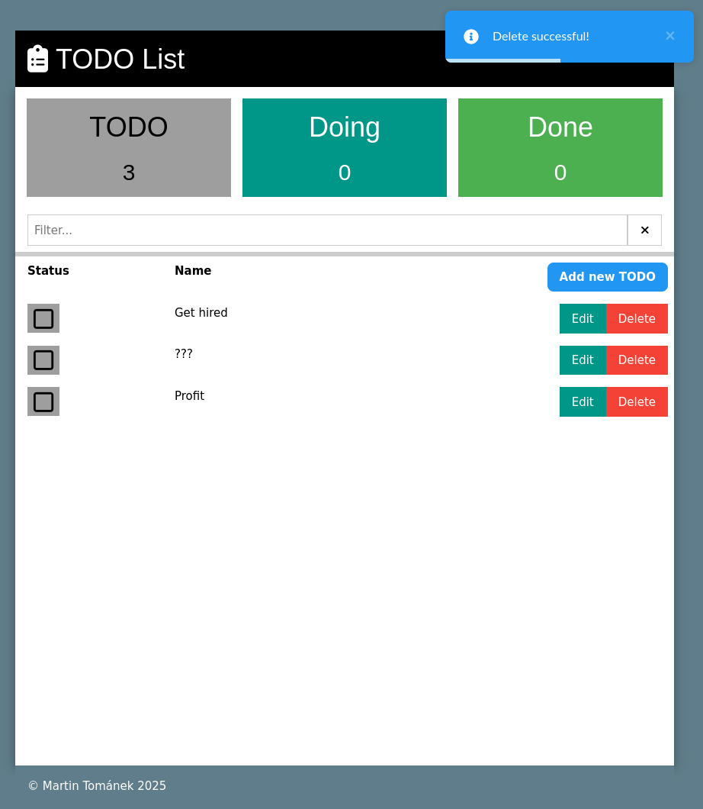

# Fullstack TODO app

Decided to join the backend and frontend repos for simplicity's sake, although
in retrospect it made commit history a little messy.

## Assignment in brief

Build a TODO list app with Spring Boot backend (REST API + database) and Vue.js
frontend. Implement CRUD operations on single entity and include one unit test.

## Quick Start

Get up and running in no time with Docker Compose.

```bash
$ docker-compose up
```

Once running, you can explore:

- Backend REST API: http://localhost:8080/swagger-ui/index.html
- Frontend: http://localhost:5173/

Of course, it is possible to run both the frontend and backend locally if you
prefer.

Feel free to explore appropriate `README.md` files in `backend` and `frontend`
folders for further details regarding design and implementation decisions.

## Visual Tour

### Backend swagger



### Frontend

#### Create

|                          Add modal                          |                              Add success                              |
|:-----------------------------------------------------------:|:---------------------------------------------------------------------:|
|  |  |

### Update

|                           Update modal                            |                               Update success                                |
|:-----------------------------------------------------------------:|:---------------------------------------------------------------------------:|
|  |  |

### Delete

|                           Delete modal                            |                               Delete success                                |
|:-----------------------------------------------------------------:|:---------------------------------------------------------------------------:|
|  |  |


